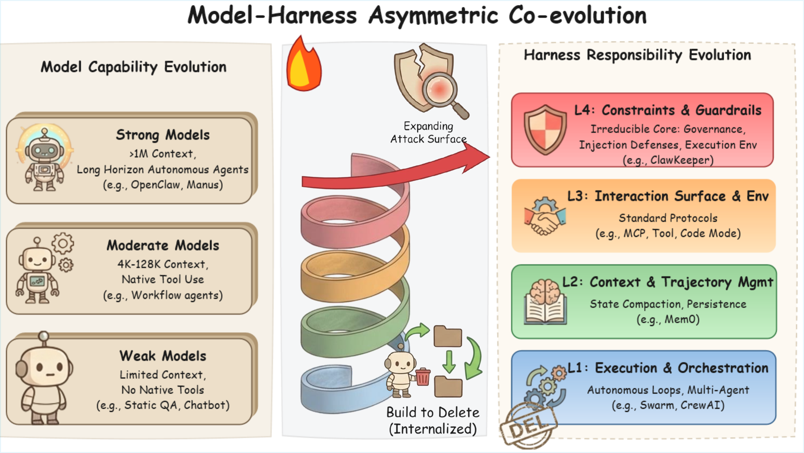

# Awesome Agent Harness 🛠️

[](https://awesome.re)

A curated list of pioneering research papers, tools, and resources on the **Agent Harness** — the systematic execution layer that transforms raw model capability into sustained, long-horizon autonomy.

Survey: ***A Survey on AI Agent Harness*** (coming soon on arXiv)

> **Agent = Model (Stochastic Intelligence) + Harness (Deterministic Infrastructure)**

The survey proposes a **Unified Architectural Taxonomy** that organizes the Agent Harness as a four-layered stack:

- **Layer 1: Execution & Orchestration** — The temporal engine driving the autonomous execution loop, model routing, and multi-agent composition.
- **Layer 2: Context & Trajectory Management** — The epistemic layer governing state compaction, trajectory persistence, memory hierarchies, and observability.
- **Layer 3: Interaction Surface & Execution Environment** — The sensory and actuation organs connecting the agent to the world via tool calling, standardized protocols, and sandboxed execution.
- **Layer 4: Constraints & Guardrails** — The independent observer enforcing deterministic laws through access control, permission management, and defense against agent injection.

Below is a visual representation of this taxonomy:



We aim to provide a comprehensive overview for researchers, developers, and infrastructure engineers interested in this rapidly advancing field.

---

## Contents

- [Agent Harness Foundations](#agent-harness-foundations)
  - [Model & Agent Routing](#model--agent-routing)
  - [Multi-Agent Composition & Orchestration](#multi-agent-composition--orchestration)
  - [Autonomous Loop, Resilience & Human-in-the-Loop](#autonomous-loop-resilience--human-in-the-loop)
  - [Memory Systems](#memory-systems)
  - [Context Compression](#context-compression)
  - [Trajectory Persistence & Observability](#trajectory-persistence--observability)
  - [Self-Evolving Architectures](#self-evolving-architectures)
  - [Agentic Skills](#agentic-skills)
  - [Skills Security](#skills-security)
  - [Standardized Protocols & Interaction Surface](#standardized-protocols--interaction-surface)
  - [Tool Use & Code Execution](#tool-use--code-execution)
  - [Sandboxing & Execution Environments](#sandboxing--execution-environments)
  - [Governance Boundaries](#governance-boundaries)
  - [Agent Injection & Defense](#agent-injection--defense)

---

## Agent Harness Foundations

Cross-layer conceptual works that define and motivate the Agent Harness as a first-class research object.

- **[Effective harnesses for long-running agents](https://www.anthropic.com/engineering/effective-harnesses-for-long-running-agents)** — *Young et al. (2025)* — long-running agent harness management []()
- **[Natural-Language Agent Harnesses](https://arxiv.org/abs/2603.25723)** — *Pan et al. (2026)* — natural-language harness design
- **[Harness Engineering for Language Agents: The Harness Layer as Control, Agency, and Runtime](https://www.preprints.org/manuscript/202603.1756)** — *He et al. (2026)* — harness as control, agency, and runtime layer
- **[Building AI Coding Agents for the Terminal: Scaffolding, Harness, Context Engineering, and Lessons Learned](https://arxiv.org/abs/2603.05344)** — *Bui et al. (2026)* — terminal coding agent scaffolding, context engineering, lessons learned
- **[Harness engineering: leveraging Codex in an agent-first world](https://openai.com/index/harness-engineering/)** — *Lopopolo et al. (2026)* — Codex-based harness engineering []()
- **[The importance of Agent Harness in 2026](https://www.philschmid.de/agent-harness-2026)** — *Schmid et al. (2026)* — agent harness importance analysis []()
- **[What is an agent harness in the context of large-language models?](https://parallel.ai/articles/what-is-an-agent-harness)** — *Parallel Web Systems et al. (2025)* — agent harness concept overview []()
- **[Meta-Harness: End-to-End Optimization of Model Harnesses](https://arxiv.org/abs/2603.28052)** — *Lee et al. (2026)* — end-to-end automated optimization of harness code

## Layer 1: Execution & Orchestration

Acting as the **temporal engine** of the harness, Layer 1 drives the autonomous execution loop, manages model routing, orchestrates multi-agent compositions, and enforces resilience mechanisms to maintain forward momentum under failures.

### Model & Agent Routing

Dynamically determining which LLM or specialized agent should handle a given subtask, optimizing for cost, capability, and resource constraints.

- **[EvoRoute: Experience-Driven Self-Routing LLM Agent Systems](https://arxiv.org/abs/2601.02695)** — *Zhang et al. (2026)* — experience-driven self-routing
- **[Best-route: Adaptive llm routing with test-time optimal compute](https://arxiv.org/abs/2506.22716)** — *Ding et al. (2025)* — test-time optimal compute routing
- **[Masrouter: Learning to route llms for multi-agent systems](https://arxiv.org/abs/2502.11133)** — *Yue et al. (2025)* — multi-agent system routing learning
- **[Adaptive vision-language model routing for computer use agents](https://arxiv.org/abs/2603.12823)** — *Liu et al. (2026)* — adaptive VLM routing for computer use
- **[Camar: Continuous actions multi-agent routing](https://arxiv.org/abs/2508.12845)** — *Pshenitsyn et al. (2026)* — continuous-action multi-agent routing
- **[SkillOrchestra: Learning to Route Agents via Skill Transfer](https://arxiv.org/abs/2602.19672)** — *Wang et al. (2026)* — skill-transfer-based agent routing
- **[DyTopo: Dynamic Topology Routing for Multi-Agent Reasoning via Semantic Matching](https://arxiv.org/abs/2602.06039)** — *Lu et al. (2026)* — semantic-matching topology routing
- **[Orchestrating Intelligence: Confidence-Aware Routing for Efficient Multi-Agent Collaboration across Multi-Scale Models](https://arxiv.org/abs/2601.04861)** — *Wang et al. (2026)* — confidence-aware multi-scale routing
- **[Learning Query-Aware Budget-Tier Routing for Runtime Agent Memory](https://arxiv.org/abs/2602.06025)** — *Zhang et al. (2026)* — query-aware budget-tier memory routing
- **[CASTER: Breaking the Cost-Performance Barrier in Multi-Agent Orchestration via Context-Aware Strategy for Task Efficient Routing](https://arxiv.org/abs/2601.19793)** — *Liu et al. (2026)* — context-aware task-efficient routing
- **[Budget-aware agentic routing via boundary-guided training](https://arxiv.org/abs/2602.21227)** — *Zhang et al. (2026)* — boundary-guided budget-aware routing
- **[ODAR: Principled Adaptive Routing for LLM Reasoning via Active Inference](https://arxiv.org/abs/2602.23681)** — *Ma et al. (2026)* — active-inference adaptive routing
- **[Optimal-agent-selection: State-aware routing framework for efficient multi-agent collaboration](https://arxiv.org/abs/2511.02200)** — *Wang et al. (2025)* — state-aware optimal agent selection
- **[Towards generalized routing: Model and agent orchestration for adaptive and efficient inference](https://arxiv.org/abs/2509.07571)** — *Guo et al. (2025)* — generalized model-agent orchestration

### Multi-Agent Composition & Orchestration

Treating agents as composable, modular entities and orchestrating concurrent subagent spawning, delegation, and synchronized state handoffs.

- **[Claude Code Subagents](https://docs.anthropic.com/en/docs/claude-code/subagents)** — *Anthropic (2025)* — custom AI subagent spawning []()
- **[Compass: Enhancing agent long-horizon reasoning with evolving context](https://arxiv.org/abs/2510.08790)** — *Wan et al. (2025)* — evolving context for long-horizon reasoning
- **[Kimi K2. 5: Visual Agentic Intelligence](https://arxiv.org/abs/2602.02276)** — *Team et al. (2026)* — visual agentic intelligence
- **[Swarm: An educational framework exploring ergonomic, lightweight multi-agent orchestration](https://github.com/openai/swarm)** — *OpenAI et al. (2024)* — lightweight multi-agent orchestration []()
- **[CrewAI: Framework for orchestrating role-playing autonomous AI agents](https://github.com/crewAIInc/crewAI)** — *Moura et al. (2025)* — role-playing agent orchestration []()
- **[A Declarative Language for Building And Orchestrating LLM-Powered Agent Workflows](https://arxiv.org/abs/2512.19769)** — *Daunis et al. (2025)* — declarative agent workflow language
- **[Orchestral AI: A Framework for Agent Orchestration](https://arxiv.org/abs/2601.02577)** — *Roman et al. (2026)* — general-purpose agent orchestration

### Autonomous Loop, Resilience & Human-in-the-Loop

Ensuring the execution loop is resilient to non-termination and drift, and managing the spectrum from full human oversight to closed-loop autonomy.

- **[Human-in-the-Loop or AI-in-the-Loop? Automate or Collaborate?](https://arxiv.org/abs/2412.14232)** — *Natarajan et al. (2025)* — human-in-the-loop vs AI-in-the-loop
- **[Adaptive fault tolerance mechanisms of large language models in cloud computing environments](https://arxiv.org/abs/2503.12228)** — *Jin et al. (2025)* — adaptive fault tolerance in cloud LLMs
- **[ESAA: Event Sourcing for Autonomous Agents in LLM-Based Software Engineering](https://arxiv.org/abs/2602.23193)** — *dos Santos Filho et al. (2026)* — event sourcing for autonomous agents
- **[Combining LLM, Non-monotonic Logical Reasoning, and Human-in-the-loop Feedback in an Assistive AI Agent](https://ieeexplore.ieee.org/abstract/document/11217618/)** — *Fu et al. (2025)* — LLM + non-monotonic reasoning + HITL
- **[Enabling self-improving agents to learn at test time with human-in-the-loop guidance](https://arxiv.org/abs/2507.17131)** — *He et al. (2025)* — test-time learning with human guidance
- **[Planagent: A multi-modal large language agent for closed-loop vehicle motion planning](https://arxiv.org/abs/2406.01587)** — *Zheng et al. (2026)* — closed-loop vehicle motion planning
- **[A multi-AI agent system for autonomous optimization of agentic AI solutions via iterative refinement and LLM-driven feedback loops](https://arxiv.org/abs/2412.17149)** — *Yuksel et al. (2025)* — iterative refinement via LLM feedback
- **[Towards LLM-enabled autonomous combustion research: A literature-aware agent for self-corrective modeling workflows](https://arxiv.org/abs/2601.01357)** — *Xiao et al. (2026)* — autonomous combustion research agent
- **[From llm reasoning to autonomous ai agents: A comprehensive review](https://arxiv.org/abs/2504.19678)** — *Ferrag et al. (2025)* — LLM reasoning to autonomous agents survey

## Layer 2: Context & Trajectory Management

While the orchestration layer manages execution time, Layer 2 governs the agent's **epistemic space** — mitigating context window saturation, catastrophic forgetting, and maintaining strict observability.

### Memory Systems

Structured, queryable knowledge layers ranging from production-ready platforms to research prototypes.

- **[Mem0: Building production-ready ai agents with scalable long-term memory](https://arxiv.org/abs/2504.19413)** — *Chhikara et al. (2025)* — scalable production long-term memory
- **[Zep: a temporal knowledge graph architecture for agent memory](https://arxiv.org/abs/2501.13956)** — *Rasmussen et al. (2025)* — temporal knowledge graph memory
- **[Memory is all you need: Testing how model memory affects llm performance in annotation tasks](https://arxiv.org/abs/2503.04874)** — *Timoneda et al. (2025)* — memory effects on LLM annotation
- **[AMemGym: Interactive Memory Benchmarking for Assistants in Long-Horizon Conversations](https://arxiv.org/abs/2603.01966)** — *Jiayang et al. (2026)* — interactive memory benchmarking
- **[Evaluating memory in llm agents via incremental multi-turn interactions](https://arxiv.org/abs/2507.05257)** — *Hu et al. (2025)* — incremental multi-turn memory eval
- **[Nemori: Self-organizing agent memory inspired by cognitive science](https://arxiv.org/abs/2508.03341)** — *Nan et al. (2025)* — self-organizing cognitive memory
- **[MemGPT: towards LLMs as operating systems.](https://arxiv.org/abs/2310.08560)** — *Packer et al. (2023)* — LLM as operating system with memory tiers
- **[A-mem: Agentic memory for llm agents](https://arxiv.org/abs/2502.12110)** — *Xu et al. (2025)* — agentic self-organizing memory
- **[Memagent: Reshaping long-context llm with multi-conv rl-based memory agent](https://arxiv.org/abs/2507.02259)** — *Yu et al. (2025)* — multi-conv RL-based memory agent
- **[G-memory: Tracing hierarchical memory for multi-agent systems](https://arxiv.org/abs/2506.07398)** — *Zhang et al. (2025)* — hierarchical multi-agent memory tracing
- **[Hipporag: Neurobiologically inspired long-term memory for large language models](https://arxiv.org/abs/2405.14831)** — *Gutierrez et al. (2024)* — neurobiological long-term memory
- **[SimpleMem: Efficient Lifelong Memory for LLM Agents](https://arxiv.org/abs/2601.02553)** — *Liu et al. (2026)* — efficient lifelong memory for agents
- **[General agentic memory via deep research](https://arxiv.org/abs/2511.18423)** — *Yan et al. (2025)* — agentic memory via deep research
- **[Choosing How to Remember: Adaptive Memory Structures for LLM Agents](https://arxiv.org/abs/2602.14038)** — *Lu et al. (2026)* — adaptive memory structure selection
- **[From Lossy to Verified: A Provenance-Aware Tiered Memory for Agents](https://arxiv.org/abs/2602.17913)** — *Zhu et al. (2026)* — provenance-aware tiered memory
- **[Lifelong learning of large language model based agents: A roadmap](https://arxiv.org/abs/2501.07278)** — *Zheng et al. (2026)* — lifelong learning roadmap for agents
- **[Memory Poisoning Attack and Defense on Memory Based LLM-Agents](https://arxiv.org/abs/2601.05504)** — *Sunil et al. (2026)* — memory poisoning attack and defense

### Context Compression

Strategies to prevent **Context Rot** — the progressive degradation of reasoning quality due to accumulated irrelevant tokens.

- **[Acon: Optimizing context compression for long-horizon llm agents](https://arxiv.org/abs/2510.00615)** — *Kang et al. (2025)* — long-horizon agent context compression
- **[Longllmlingua: Accelerating and enhancing llms in long context scenarios via prompt compression](https://arxiv.org/abs/2310.06839)** — *Jiang et al. (2024)* — prompt compression via token scoring
- **[Scaling llm multi-turn rl with end-to-end summarization-based context management](https://arxiv.org/abs/2510.06727)** — *Lu et al. (2025)* — summarization-based context management
- **[Longcodebench: Evaluating coding llms at 1m context windows](https://arxiv.org/abs/2505.07897)** — *Rando et al. (2025)* — 1M-token coding evaluation
- **[Scaling long-horizon llm agent via context-folding](https://arxiv.org/abs/2510.11967)** — *Sun et al. (2025)* — hierarchical trajectory folding
- **[Pretraining context compressor for large language models with embedding-based memory](https://aclanthology.org/2025.acl-long.1394/)** — *Dai et al. (2025)* — embedding-based context compressor
- **[SWE-Pruner: Self-Adaptive Context Pruning for Coding Agents](https://arxiv.org/abs/2601.16746)** — *Wang et al. (2026)* — self-adaptive context pruning for code
- **[The Complexity Trap: Simple Observation Masking Is as Efficient as LLM Summarization for Agent Context Management](https://arxiv.org/abs/2508.21433)** — *Lindenbauer et al. (2025)* — observation masking vs summarization
- **[Longcodezip: Compress long context for code language models](https://arxiv.org/abs/2510.00446)** — *Shi et al. (2025)* — long-context code compression
- **[Mem1: Learning to synergize memory and reasoning for efficient long-horizon agents](https://arxiv.org/abs/2506.15841)** — *Zhou et al. (2025)* — synergize memory and reasoning
- **[ContextBench: A Benchmark for Context Retrieval in Coding Agents](https://arxiv.org/abs/2602.05892)** — *Li et al. (2026)* — context retrieval benchmarking
- **[Memrl: Self-evolving agents via runtime reinforcement learning on episodic memory](https://arxiv.org/abs/2601.03192)** — *Zhang et al. (2026)* — runtime RL on episodic memory
- **[Hiagent: Hierarchical working memory management for solving long-horizon agent tasks with large language model](https://arxiv.org/abs/2408.09559)** — *Hu et al. (2025)* — hierarchical working memory management
- **[SWE Context Bench: A Benchmark for Context Learning in Coding](https://arxiv.org/abs/2602.08316)** — *Zhu et al. (2026)* — context learning benchmarking
- **[Safesieve: From heuristics to experience in progressive pruning for llm-based multi-agent communication](https://arxiv.org/abs/2508.11733)** — *Zhang et al. (2026)* — progressive multi-agent comm pruning

### Trajectory Persistence & Observability

Persisting the agent's execution history to external storage for recovery, replay, and continuous learning, while decoupling observability from the model's working memory.

- **[Reducing Cost of LLM Agents with Trajectory Reduction](https://arxiv.org/abs/2509.23586)** — *Xiao et al. (2025)* — trajectory reduction for efficiency
- **[Semantic Checkpointing for Stateless LLM Agents in Multi-Tenant Enterprise Systems](https://www.researchgate.net/publication/399433967_Semantic_Checkpointing_for_Stateless_LLM_Agents_Semantic_Checkpointing_for_Stateless_LLM_Agents_in_Multi-Tenant_Enterprise_Systems)** — *Roshan et al. (2025)* — semantic checkpointing for stateless agents
- **[Large-scale Evaluation of Notebook Checkpointing with AI Agents](https://arxiv.org/abs/2504.01377)** — *Fang et al. (2025)* — notebook checkpointing evaluation
- **[AgentTrace: A Structured Logging Framework for Agent System Observability](https://arxiv.org/abs/2602.10133)** — *AlSayyad et al. (2026)* — structured logging for observability
- **[AgentSight: System-Level Observability for AI Agents Using eBPF](https://arxiv.org/abs/2508.02736)** — *Zheng et al. (2025)* — eBPF-based system-level observability
- **[Durable Execution in LangGraph](https://docs.langchain.com/oss/python/langgraph/durable-execution)** — *LangChain et al. (2026)* — fault-tolerant durable execution []()

### Self-Evolving Architectures

Agent systems that improve their own capabilities, prompts, or memory structures at test time or through continuous interaction.

- **[Darwin godel machine: Open-ended evolution of self-improving agents](https://arxiv.org/abs/2505.22954)** — *Zhang et al. (2025)* — open-ended self-improving evolution
- **[Your agent may misevolve: Emergent risks in self-evolving llm agents](https://arxiv.org/abs/2509.26354)** — *Shao et al. (2025)* — emergent risks in self-evolution
- **[Live-SWE-agent: Can Software Engineering Agents Self-Evolve on the Fly?](https://arxiv.org/abs/2511.13646)** — *Xia et al. (2025)* — on-the-fly SWE agent self-evolution
- **[Agentic context engineering: Evolving contexts for self-improving language models](https://arxiv.org/abs/2510.04618)** — *Zhang et al. (2025)* — evolving contexts for self-improvement
- **[Gepa: Reflective prompt evolution can outperform reinforcement learning](https://arxiv.org/abs/2507.19457)** — *Agrawal et al. (2025)* — reflective prompt evolution
- **[Dynamic cheatsheet: Test-time learning with adaptive memory](https://arxiv.org/abs/2504.07952)** — *Suzgun et al. (2026)* — test-time learning with adaptive memory
- **[Adaptive self-improvement llm agentic system for ml library development](https://arxiv.org/abs/2502.02534)** — *Zhang et al. (2025)* — self-improvement for ML library dev
- **[AccelOpt: A Self-Improving LLM Agentic System for AI Accelerator Kernel Optimization](https://arxiv.org/abs/2511.15915)** — *Zhang et al. (2025)* — self-improving kernel optimization
- **[Memento: Fine-tuning LLM Agents without Fine-tuning LLMs](https://arxiv.org/abs/2508.16153)** — *Zhou et al. (2025)* — fine-tuning agents without LLM FT
- **[Multi-agent evolve: Llm self-improve through co-evolution](https://arxiv.org/abs/2510.23595)** — *Chen et al. (2025)* — LLM self-improve through co-evolution
- **[Ragen: Understanding self-evolution in llm agents via multi-turn reinforcement learning](https://arxiv.org/abs/2504.20073)** — *Wang et al. (2025)* — self-evolution via multi-turn RL
- **[Evo-memory: Benchmarking llm agent test-time learning with self-evolving memory](https://arxiv.org/abs/2511.20857)** — *Wei et al. (2025)* — c@benchmarking test-time self-evolving memory
- **[WebEvolver: Enhancing Web Agent Self-Improvement with Co-evolving World Model](https://arxiv.org/abs/2504.21024)** — *Fang et al. (2025)* — co-evolving web world model
- **[SEAgent: Self-Evolving Computer Use Agent with Autonomous Learning from Experience](https://arxiv.org/abs/2508.04700)** — *Sun et al. (2025)* — self-evolving computer use agent
- **[Self-evolving multi-agent simulations for realistic clinical interactions](https://arxiv.org/abs/2503.22678)** — *Almansoori et al. (2025)* — self-evolving clinical simulations
- **[EvoAgent: Self-evolving Agent with Continual World Model for Long-Horizon Tasks](https://arxiv.org/abs/2502.05907)** — *Feng et al. (2025)* — continual world model for long-horizon
- **[Tool-R0: Self-Evolving LLM Agents for Tool-Learning from Zero Data](https://arxiv.org/abs/2602.21320)** — *Acikgoz et al. (2026)* — self-evolving tool learning from zero
- **[EvoTool: Self-evolving tool-use policy optimization in llm agents via blame-aware mutation and diversity-aware selection](https://arxiv.org/abs/2603.04900)** — *Yang et al. (2026)* — blame-aware tool-use optimization
- **[AutoSkill: Experience-Driven Lifelong Learning via Skill Self-Evolution](https://arxiv.org/abs/2603.01145)** — *Yang et al. (2026)* — experience-driven lifelong skill evolution
- **[MemSkill: Learning and Evolving Memory Skills for Self-Evolving Agents](https://arxiv.org/abs/2602.02474)** — *Zhang et al. (2026)* — learning and evolving memory skills
- **[EvoConfig: Self-Evolving Multi-Agent Systems for Efficient Autonomous Environment Configuration](https://arxiv.org/abs/2601.16489)** — *Guo et al. (2026)* — self-evolving multi-agent configuration
- **[Over-Searching in Search-Augmented Large Language Models](https://arxiv.org/abs/2601.05503)** — *Xie et al. (2026)* — over-searching in search-augmented LLMs

### Agentic Skills

Modular, reusable capabilities that agents acquire, compose, and execute to extend their action space.

- **[Inducing programmatic skills for agentic tasks](https://arxiv.org/abs/2504.06821)** — *Wang et al. (2025)* — inducing programmatic skills
- **[SkillCraft: Can LLM Agents Learn to Use Tools Skillfully?](https://arxiv.org/abs/2603.00718)** — *Chen et al. (2026)* — tool-use skill learning evaluation
- **[SoK: Agentic Skills--Beyond Tool Use in LLM Agents](https://arxiv.org/abs/2602.20867)** — *Jiang et al. (2026)* — systematization of agentic skills
- **[SkillReducer: Optimizing LLM Agent Skills for Token Efficiency](https://arxiv.org/abs/2603.29919)** — *Gao et al. (2026)* — token-efficient skill optimization
- **[Agent skills for large language models: Architecture, acquisition, security, and the path forward](https://arxiv.org/abs/2602.12430)** — *Xu et al. (2026)* — skill architecture, acquisition, security
- **[Agent Skills: A Data-Driven Analysis of Claude Skills for Extending Large Language Model Functionality](https://arxiv.org/abs/2602.08004)** — *Ling et al. (2026)* — data-driven Claude skill analysis
- **[SkillRouter: Retrieve-and-Rerank Skill Selection for LLM Agents at Scale](https://arxiv.org/abs/2603.22455)** — *Zheng et al. (2026)* — retrieve-and-rerank skill selection
- **[When single-agent with skills replace multi-agent systems and when they fail](https://arxiv.org/abs/2601.04748)** — *Li et al. (2026)* — single-agent skills vs multi-agent
- **[EvoSkill: Automated Skill Discovery for Multi-Agent Systems](https://arxiv.org/abs/2603.02766)** — *Alzubi et al. (2026)* — automated multi-agent skill discovery
- **[SkillsBench: Benchmarking how well agent skills work across diverse tasks](https://arxiv.org/abs/2602.12670)** — *Li et al. (2026)* — skill benchmarking across diverse tasks
- **[Cua-skill: Develop skills for computer using agent](https://arxiv.org/abs/2601.21123)** — *Chen et al. (2026)* — skills for computer-using agents
- **[Introducing Agent Skills](https://www.anthropic.com/news/skills)** — *Anthropic et al. (2025)* — agent skill platform launch []()
- **[Reinforcement Learning for Self-Improving Agent with Skill Library](https://arxiv.org/abs/2512.17102)** — *Wang et al. (2025)* — RL-based self-improving skill library
- **[Agentic Proposing: Enhancing Large Language Model Reasoning via Compositional Skill Synthesis](https://arxiv.org/abs/2602.03279)** — *Jiao et al. (2026)* — compositional skill synthesis
- **[Gemini CLI Skills Documentation](https://geminicli.com/docs/cli/skills)** — *Google et al. (2025)* — CLI-based agent skills []()

### Skills Security

Security vulnerabilities and defenses related to agentic skill systems and skill-based prompt injection.

- **[Agent Skills Enable a New Class of Realistic and Trivially Simple Prompt Injections](https://arxiv.org/abs/2510.26328)** — *Schmotz et al. (2025)* — skill-based prompt injection analysis
- **[Agent Skills in the Wild: An Empirical Study of Security Vulnerabilities at Scale](https://arxiv.org/abs/2601.10338)** — *Liu et al. (2026)* — skill security vulnerabilities at scale
- **[Malicious Agent Skills in the Wild: A Large-Scale Security Empirical Study](https://arxiv.org/abs/2602.06547)** — *Liu et al. (2026)* — malicious skill detection study
- **[When Skills Lie: Hidden-Comment Injection in LLM Agents](https://arxiv.org/abs/2602.10498)** — *Wang et al. (2026)* — hidden-comment skill injection
- **[Zombie Agents: Persistent Control of Self-Evolving LLM Agents via Self-Reinforcing Injections](https://arxiv.org/abs/2602.15654)** — *Yang et al. (2026)* — persistent control via self-reinforcing injection

## Layer 3: Interaction Surface & Execution Environment

Because language models are inherently disembodied, Layer 3 constitutes the **sensory and actuation organs** of the agentic system — standardizing interfaces for tool calling and code execution, and enforcing hardware-level isolation.

### Standardized Protocols & Interaction Surface

Defining and standardizing how agents interact with tools, APIs, and external environments.

- **[From language to action: a review of large language models as autonomous agents and tool users](https://arxiv.org/abs/2508.17281)** — *Chowa et al. (2026)* — LLM as autonomous agent review
- **[Defining and Detecting the Defects of Large Language Model-based Autonomous Agents](https://arxiv.org/abs/2412.18371)** — *Ning et al. (2026)* — LLM agent defect detection
- **[Llm agents making agent tools](https://arxiv.org/abs/2502.11705)** — *Wolflein et al. (2025)* — agents making agent tools
- **[Code-Mode: Plug-and-play library to enable agents to call MCP and UTCP tools via code execution](https://github.com/universal-tool-calling-protocol/code-mode)** — *Protocol et al. (2026)* — MCP/UTCP via code execution []()
- **[Ui-tars: Pioneering automated gui interaction with native agents](https://arxiv.org/abs/2501.12326)** — *Qin et al. (2025)* — native automated GUI interaction
- **[GeoJSON agents: a multi-agent LLM architecture for geospatial analysis—function calling vs. code generation](https://www.tandfonline.com/doi/full/10.1080/20964471.2026.2615511)** — *Luo et al. (2026)* — function calling vs code generation
- **[Beyond Perfect APIs: A Comprehensive Evaluation of LLM Agents Under Real-World API Complexity](https://arxiv.org/abs/2601.00268)** — *Kim et al. (2026)* — real-world API complexity evaluation

### Tool Use & Code Execution

Benchmarks and methods for evaluating and improving agent tool use capabilities.

- **[WebOperator: Action-Aware Tree Search for Autonomous Agents in Web Environment](https://arxiv.org/abs/2512.12692)** — *Dihan et al. (2025)* — action-aware web tree search
- **[Terminal-bench: Benchmarking agents on hard, realistic tasks in command line interfaces](https://arxiv.org/abs/2601.11868)** — *Merrill et al. (2026)* — CLI task benchmarking
- **[Budget-Constrained Agentic Large Language Models: Intention-Based Planning for Costly Tool Use](https://arxiv.org/abs/2602.11541)** — *Liu et al. (2026)* — budget-constrained tool planning
- **[Toolsandbox: A stateful, conversational, interactive evaluation benchmark for llm tool use capabilities](https://arxiv.org/abs/2408.04682)** — *Lu et al. (2025)* — stateful tool-use evaluation

## Layer 4: Constraints & Guardrails

Because LLM outputs are inherently probabilistic, Layer 4 acts as an **independent observer and judge** — imposing deterministic laws of physics and security boundaries on the system, operating entirely out-of-band.

### Sandboxing & Execution Environments

Isolating agent execution to contain erratic behaviors and protect host infrastructure.

- **[The two patterns by which agents connect sandboxes](https://blog.langchain.dev/the-two-patterns-by-which-agents-connect-sandboxes/)** — *LangChain et al. (2026)* — agent-sandbox connection patterns []()
- **[SWE-MiniSandbox: Container-Free Reinforcement Learning for Building Software Engineering Agents](https://arxiv.org/abs/2602.11210)** — *Yuan et al. (2026)* — container-free RL sandbox
- **[Ui-tars-2 technical report: Advancing gui agent with multi-turn reinforcement learning](https://arxiv.org/abs/2509.02544)** — *Wang et al. (2025)* — multi-turn RL GUI agent sandbox
- **[Computer Environments Elicit General Agentic Intelligence in LLMs](https://arxiv.org/abs/2601.16206)** — *Cheng et al. (2026)* — sandbox for agentic intelligence
- **[Sari Sandbox: A Virtual Retail Store Environment for Embodied AI Agents](https://arxiv.org/abs/2508.00400)** — *Gajo et al. (2025)* — virtual retail store environment
- **[SandboxSocial: A Sandbox for Social Media Using Multimodal AI Agents](https://www.ijcai.org/proceedings/2025/1271)** — *Touzel et al. (2025)* — social media simulation sandbox
- **[cellmate: Sandboxing browser ai agents](https://arxiv.org/abs/2512.12594)** — *Meng et al. (2025)* — browser AI agent sandboxing
- **[AgentBay: A Hybrid Interaction Sandbox for Seamless Human-AI Intervention in Agentic Systems](https://arxiv.org/abs/2512.04367)** — *Piao et al. (2025)* — hybrid human-AI interaction sandbox
- **[Static Sandboxes Are Inadequate: Modeling Societal Complexity Requires Open-Ended Co-Evolution in LLM-Based Multi-Agent Simulations](https://arxiv.org/abs/2510.13982)** — *Chen et al. (2025)* — c@static sandboxes are inadequate; open-ended co-evolution needed
- **[Deepresearchgym: A free, transparent, and reproducible evaluation sandbox for deep research](https://arxiv.org/abs/2505.19253)** — *Coelho et al. (2025)* — reproducible deep research evaluation
- **[SWE-World: Building Software Engineering Agents in Docker-Free Environments](https://arxiv.org/abs/2602.03419)** — *Sun et al. (2026)* — Docker-free SWE environments
- **[R2e-gym: Procedural environments and hybrid verifiers for scaling open-weights swe agents](https://arxiv.org/abs/2504.07164)** — *Jain et al. (2025)* — procedural environments with hybrid verifiers

### Governance Boundaries

Enforcing access control, permission management, and policy compliance for agent actions.

- **[POLARIS: Typed Planning and Governed Execution for Agentic AI in Back-Office Automation](https://arxiv.org/abs/2601.11816)** — *Moslemi et al. (2026)* — typed planning and governed execution
- **[ContextCov: Deriving and Enforcing Executable Constraints from Agent Instruction Files](https://arxiv.org/abs/2603.00822)** — *Sharma et al. (2026)* — executable constraint enforcement
- **[Sandbox-runtime: A lightweight sandboxing tool for enforcing filesystem and network restrictions on arbitrary processes at the OS level, without requiring a container](https://github.com/anthropic-experimental/sandbox-runtime)** — *Anthropic et al. (2026)* — OS-level filesystem/network sandboxing []()
- **[Securing AI Agent Execution](https://arxiv.org/abs/2510.21236)** — *Buhler et al. (2025)* — agent execution security analysis
- **[BashArena: A Control Setting for Highly Privileged AI Agents](https://arxiv.org/abs/2512.15688)** — *Kaufman et al. (2025)* — highly-privileged agent control setting
- **[Breaking the Protocol: Security Analysis of the Model Context Protocol Specification and Prompt Injection Vulnerabilities in Tool-Integrated LLM Agents](https://arxiv.org/abs/2601.17549)** — *Maloyan et al. (2026)* — MCP specification security analysis

### Agent Injection & Defense

Defending against adversarial prompt injection attacks targeting agentic systems.

- **[Skill-Inject: Measuring Agent Vulnerability to Skill File Attacks](https://arxiv.org/abs/2602.20156)** — *Schmotz et al. (2026)* — skill file attack measurement
- **[AgentDyn: A Dynamic Open-Ended Benchmark for Evaluating Prompt Injection Attacks of Real-World Agent Security System](https://arxiv.org/abs/2602.03117)** — *Li et al. (2026)* — dynamic prompt injection benchmark
- **[WebSentinel: Detecting and Localizing Prompt Injection Attacks for Web Agents](https://arxiv.org/abs/2602.03792)** — *Wang et al. (2026)* — web agent injection detection
- **[ReasAlign: Reasoning Enhanced Safety Alignment against Prompt Injection Attack](https://arxiv.org/abs/2601.10173)** — *Li et al. (2026)* — reasoning-enhanced injection safety
- **[From assistant to double agent: Formalizing and benchmarking attacks on openclaw for personalized local ai agent](https://arxiv.org/abs/2602.08412)** — *Wang et al. (2026)* — c@formalizing attacks on OpenClaw for personalized local agents
- **[Taming OpenClaw: Security Analysis and Mitigation of Autonomous LLM Agent Threats](https://arxiv.org/abs/2603.11619)** — *Deng et al. (2026)* — OpenClaw security analysis and mitigation
- **[Uncovering Security Threats and Architecting Defenses in Autonomous Agents: A Case Study of OpenClaw](https://arxiv.org/abs/2603.12644)** — *Ying et al. (2026)* — OpenClaw threat architecture and defenses
- **[ClawKeeper: Comprehensive Safety Protection for OpenClaw Agents Through Skills, Plugins, and Watchers](https://arxiv.org/abs/2603.24414)** — *Liu et al. (2026)* — c@comprehensive safety via skills, plugins, and watchers
- **[A trajectory-based safety audit of clawdbot (openclaw)](https://arxiv.org/abs/2602.14364)** — *Chen et al. (2026)* — trajectory-based safety audit
- **[OpenClaw PRISM: A Zero-Fork, Defense-in-Depth Runtime Security Layer for Tool-Augmented LLM Agents](https://arxiv.org/abs/2603.11853)** — *Li et al. (2026)* — zero-fork defense-in-depth runtime
- **[OpenClaw Agents on Moltbook: Risky Instruction Sharing and Norm Enforcement in an Agent-Only Social Network](https://arxiv.org/abs/2602.02625)** — *Manik et al. (2026)* — c@risky instruction sharing and norm enforcement in agent networks

---

## Contributing

We welcome contributions! If you have a paper, tool, or resource that belongs in this list, please open a pull request or issue.

When adding a new paper, please follow the format:
```
- **[Paper Title](link)** — *Author et al. (Year)* — brief description
```

Please ensure the paper is directly relevant to the Agent Harness infrastructure (orchestration, context management, execution environments, or guardrails).

---

*This repository is maintained in conjunction with the survey paper **"A Survey on AI Agent Harness"**.*
